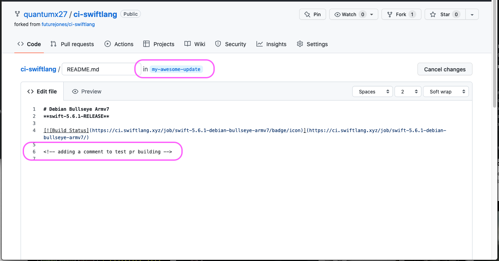

# Swift on Armv7
### Opening a PR (pull request)
#### Step 1 - Create a Fork of the Repository
First we need to create a fork of the repository.

#### Step 2 - Checkout Branch
The branch for `swift on armv7` is `debian/bullseye-5.6-armv7`  
Select this branch in the branches drop down menu.

#### Step 3 - Create New Branch
Next we need to create a new branch for our changes e.g. `my-awesome-update` based on the `debian/bullseye-5.6-armv7` branch.

#### Step 4 - Make Some Changes
All changes we make will be done in this new branch `my-awesome-update`.  
For this example we will add a simple comment to the README file.

#### Step 5 - Commit Changes
Save the changes by committing to the `my-awesome-update` branch.  

#### Step 6 - Open a Pull Request
On your repository front page tap the `Compare and pull request` button to open a pull request.  

NOTE: Make sure you select the correct repository and branches.  
When the details are correct tap the `Create pull request` button.

