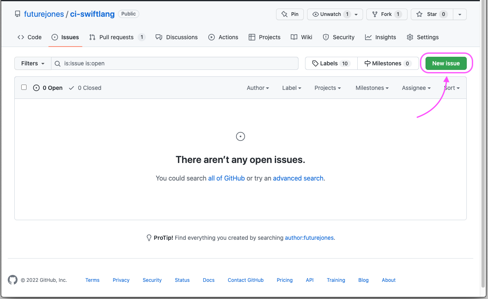
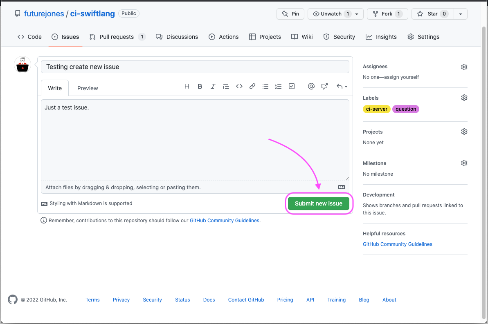
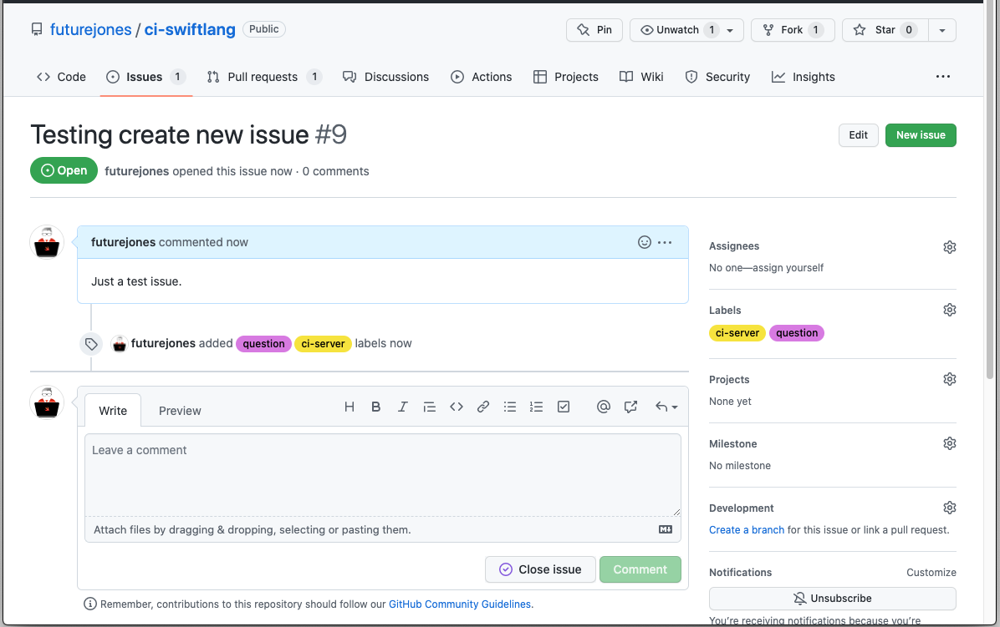
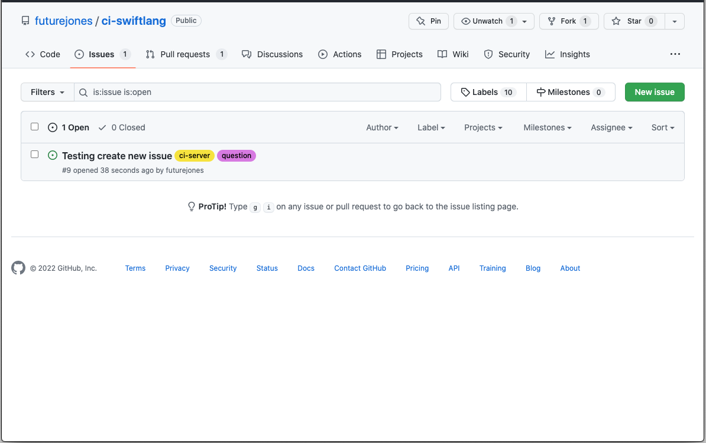
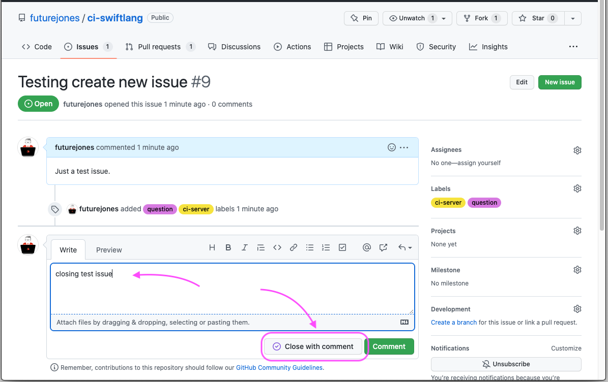

# Opening an Issue
An issue can be used for many things. Asking questions, reporting bugs, proposing fixes, requesting new features, and much more.

#### Step 1 - Create New Issue
Tap the `New Issue` button to start creating a new issue.

#### Step 2 - Add Details
Add a title, description and choose a suitable label.  
You may choose more than one label.

#### Step 3 - Submit Issue
Once you have checked all the details are correct, tap the `Submit New Issue` button.

The issue has now been created.

## Closing Issues
To close an issue use the `Close Issue` button.  
You can also add a closing comment if it is needed.

