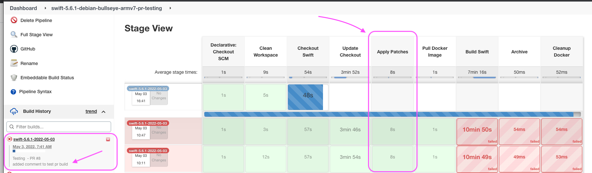

# Submitting a Patch for Testing

#### The Jenkins Pipeline
The PR testing build job is a Jenkins pipeline.



A pipeline is made up of `stages` and within each `stage` there are `steps`.  
The `pipeline` setup and flow is controlled by a `Jenkinsfile`.  
Looking at a section of the `Jenkinsfile` below you can see there is an `Apply Patches`stage that corresponds with the `Stage View` above.

```groovy
stage('Apply Patches') {
         steps {
            echo 'Apply Patches'
            dir('swift-docc') {
               echo "patch fix for python 3.9 +"
               sh 'wget https://github.com/apple/swift-docc/pull/73.patch'
               sh 'git apply 73.patch'
            }
            dir('swift') {
               echo "add swiftlang-min preset"
               sh 'git apply $WORKSPACE/patches/swiftlang-min.patch'
               echo "patch fix for AST errors"
               sh 'patch -p2 < $WORKSPACE/patches/swift-arm.patch'
            }
            dir('swift-corelibs-libdispatch') {
               echo "patch fix for benchmark errors"
               sh 'git apply $WORKSPACE/patches/benchmark.diff'
            }
         }
      }
```
All `patches` will be added in this stage.

#### Patch Location

The `patches` can be stored locally in the `patches` directory or remotely in another github repository.  
`patch` files can also be generated automatically from #PR's in other repositories by adding `.patch` to the #PR url.

#### Applying the Patch
Patches can be applied using `git apply` or `patch`, whichever suits best.

## Example 1 - Testing a Remote Patch
In this example we will add a patch from an official #PR in the `swift-docc` repository.  
https://github.com/apple/swift-docc/pull/73

#### Step 1 - Fork the Repository
Create a fork of the repository and create a new working branch based on the `debian/bullseye-5.6-armv7` branch as shown in the [Open a Pull Request](open-a-pr.md) docs.

#### Step 2 - Edit the Jenkinsfile
Inside the `Apply Patches` stage the following code will add a `step` to download and apply the patch.
```groovy
dir('swift-docc') {
    echo "patch fix for python 3.9 +"
    sh 'wget https://github.com/apple/swift-docc/pull/73.patch'
    sh 'git apply 73.patch'
}
```
As the swift build consists of the cloning and building of multiple repositories, it is important to apply the patch to the correct repository.  
This is done with the `dir` command.  
```groovy
dir('swift-docc') // move to the swift-docc directory
```
In a Jenkinsfile `sh` replicates a terminal command.  
Download the patch
```groovy
sh 'wget https://github.com/apple/swift-docc/pull/73.patch'
```
Apply the patch
```groovy
sh 'git apply 73.patch'
```

## Example 2 - Testing a Local Patch
In this example we will add a local patch `swift-arm.patch` to the `swift` repository.

#### Step 1 - Fork the Repository
As above...

#### Step 2 - Add the Patch
Add the patch to the `patches` directory.

#### Step 3 - Edit the Jenkinsfile
This step is the same as above except we don't need to download the patch file as it already exists in the repository.  
Make sure you are in the correct directory and have the correct path to the patch file.
```groovy
dir('swift') {
    echo "patch fix for AST errors"
    sh 'patch -p2 < $WORKSPACE/patches/swift-arm.patch'
}
```
## Submit for Testing
Once you have finished editing the `Jenkinsfile` you can open a pull request to test the patch.
